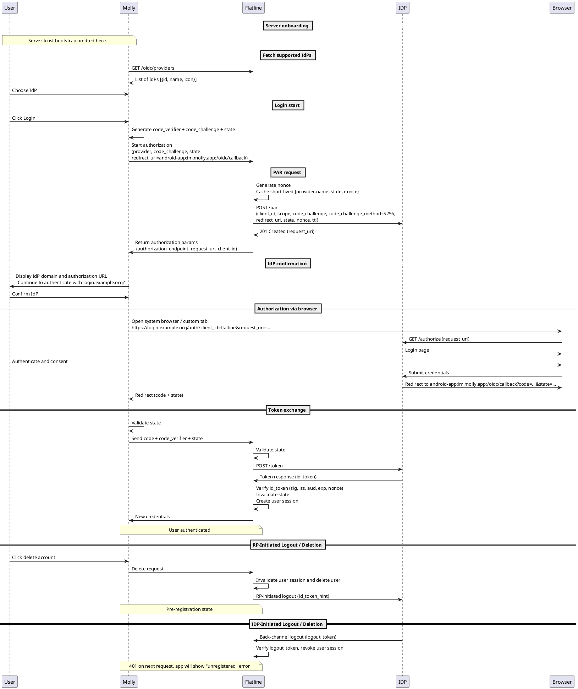

# Flatline: Phone-less Registration – Working Draft

> **Status:** Working Draft<br>
> **Maintainers:** @valldrac<br>

---

## Overview

Signal links every account to a phone number. It serves as the login credential, proof of account ownership, and
an anti‑abuse barrier.
This document describes how we plan to remove that dependency in Flatline.

SMS verification is replaced by [OpenID Connect (OIDC)](https://openid.net/connect/).
Instead of entering a phone number and waiting for an SMS code, users authenticate through an identity provider (IdP),
such as a company SSO, standard OIDC provider, or public login service.
On sign-in, the server derives a *principal* from the IdP's identity claims. In Flatline's data model, this principal
takes the same structural role as the phone number in Signal.

Two initial deployment profiles are in scope:

- **Profile A** (enterprise): an organization controls membership through its internal IdP and directory.
- **Profile B** (community): the server administrator controls who can register by choosing which IdP to trust.
  The IdP can be self-hosted or a third-party OIDC provider.

A third profile C, **open self-signup public server**, is out of scope for now: we have not found proven anti-abuse
mechanisms for that profile yet.

This is a working draft, and feedback is welcome on all sections.
We especially welcome feedback on unresolved design choices, security/privacy tradeoffs, and any errors,
omissions, or assumptions we got wrong.
See [CONTRIBUTING.md](../CONTRIBUTING.md) for how to participate.

This document specifies the server-side registration and identity model only.
Client-side changes required for Molly and other apps will be covered separately.

---

<!-- TOC -->
* [Flatline: Phone-less Registration – Working Draft](#flatline-phone-less-registration--working-draft)
  * [Overview](#overview)
  * [Current Baseline](#current-baseline)
    * [Data Domains and Persistence](#data-domains-and-persistence)
    * [Backup Secret Model](#backup-secret-model)
  * [Goals and Constraints](#goals-and-constraints)
  * [Threat Model (delta from Signal)](#threat-model-delta-from-signal)
  * [Anti-abuse Implications](#anti-abuse-implications)
  * [Deployment Profiles](#deployment-profiles)
    * [A. Organization with internal directory](#a-organization-with-internal-directory)
    * [B. Community or private server](#b-community-or-private-server)
    * [C. Open self-signup public server](#c-open-self-signup-public-server)
  * [OIDC-based Registration Analysis](#oidc-based-registration-analysis)
    * [Account and Principal Mapping](#account-and-principal-mapping)
    * [Principal Updates](#principal-updates)
    * [Principal Uniqueness and Cross-IdP Collisions](#principal-uniqueness-and-cross-idp-collisions)
    * [Recovery Model](#recovery-model)
  * [Key Design Decisions](#key-design-decisions)
    * [Phone-less Registration](#phone-less-registration)
    * [Federation Scope and Future Compatibility](#federation-scope-and-future-compatibility)
    * [Username Semantics](#username-semantics)
    * [Optional Principal Mapping](#optional-principal-mapping)
    * [Server Trust Bootstrap](#server-trust-bootstrap)
  * [Requested Feedback](#requested-feedback)
* [Annex A — Registration Specification Overview](#annex-a--registration-specification-overview)
  * [Client Roles and Trust Model](#client-roles-and-trust-model)
  * [Entities and Invariants](#entities-and-invariants)
  * [Whisper Interfaces](#whisper-interfaces)
  * [Whisper Data Model](#whisper-data-model)
  * [Whisper Configuration](#whisper-configuration)
  * [Sequence Diagram](#sequence-diagram)
  * [JWKS Trust and Pinning](#jwks-trust-and-pinning)
<!-- TOC -->

---

## Current Baseline

Signal's registration and identity model works as follows:

- **Account Identifier (ACI):** UUID generated at account creation, stable across re-registrations.
- **Phone Number Identifier (PNI):** UUID tied to the phone number, changes when the phone number changes.
- **Phone number:** user-modifiable, used for registration and discovery.
- **Username**: optional and mutable, not a primary identity.
- **Identity Key (IK):** long-term key pair, root of trust for all double-ratchet sessions and prekeys.
- **Safety number:** fingerprint of both recipients' IK public keys.
- **Registration:** requires SMS verification to prove phone number ownership.
- **Login:** phone number acts as the single login factor: whoever can receive the SMS code owns the account.
- **Recovery:** users can restore their data by:
    - entering the cloud backup password (recovers data and skips SMS verification), or
    - verifying with SMS and Signal PIN:
        - SMS is skipped if backups were active in Android's Settings and the user logged in Play Services.

> Signal generates two long-term Identity Keys (IK): one linked to ACI and another to the PNI.
> Flatline does not plan to use the PNI identity (though this remains an open design question).
> For clarity, all references to the Identity Key (IK) later in this document refer to the ACI-linked key.

### Data Domains and Persistence

| Type              | Description                                                              | Persistence                                 |
|-------------------|--------------------------------------------------------------------------|---------------------------------------------|
| **Identity keys** | IK (ACI), IK (PNI).                                                      | Client only (portable via device transfer). |
| **Account data**  | Profile, avatar, username, contact list, group memberships, preferences. | Client database and server storage-service. |
| **Session store** | Signal protocol state and session keys.                                  | Client only.                                |
| **Chat history**  | Message contents, attachments, and related metadata.                     | Client and optional backup (file or CDN).   |

### Backup Secret Model

Overview of Signal's client secret lifecycle related to backup and recovery:

1. **Account Entropy Pool (AEP):**
   Client-side random secret (~330 bits of entropy) generated at registration.
    - The app displays the AEP to the user as a human-readable "backup password" (similar to Bitcoin wallet seed
      phrases).
      Users are instructed to write it down and store it securely offline.
2. **SVR Master Key:**
   Key derived from AEP and used to encrypt the account data stored in the storage-service.
3. **Backup Key:**
   Key derived from AEP and used to encrypt the backups uploaded to the CDN.
4. **Secure Value Recovery Service (SVR):**
   Signal uses HSM-backed secure enclaves to enable PIN-based recovery of the SVR Master Key without exposing it to the
   server.
   The enclave enforces guess limits and stores the encrypted secret in replicated consensus storage.
5. **Signal PIN:**
   When enabled, a hashed user PIN is registered with the SVR enclave service.
   During restore, the client authenticates to the enclave using the hashed PIN, receives the encrypted SVR Master Key,
   decrypts it locally with the PIN, and fetches the account data from the storage-service.
    - After PIN-based restore, the client generates a new AEP, stores a new SVR Master Key in the SVR, and re-encrypts
      the account data in the storage-service.

For the key derivation details, see the libsignal backup
docs: https://github.com/mollyim/libsignal/blob/main/doc/src/backups/README.md#account-keys

## Goals and Constraints

**Goals**

* Remove the hard dependency on phone numbers for registration and authentication.
* Keep server and API changes minimal and backward-compatible.
* Preserve Signal protocol semantics.
* Deprecate PIN-based recovery and remove cloud enclave dependency.
* Support configurable deployment environments.

**Constraints**

* Minimal data retention on servers.
* Resistance to mass automated account creation.
* Stay compatible if Signal itself deprecates phone-based registration.

## Threat Model (delta from Signal)

Removing phone numbers changes several core assumptions and potentially introduces new risks:

* Spoofing / impersonation.
    * Identity provider (IdP) compromise.
    * Malicious Flatline instance spoofing IdP login.
* Spam and Sybil attacks via mass fake registrations.
* Attacks against recovery or ownership-proof mechanisms.
* Account takeover or credential theft.
* Replay, rollback, or downgrade attacks on registration flows.

## Anti-abuse Implications

SMS verification acts as an implicit anti-abuse barrier: it adds cost and ties each account to a
reachable phone number. Without it, we need other mechanisms.

**Problem surface**

* Registration can be fully automated.
* Bulk account creation becomes cheap.
* Invite systems and discovery directories become targets for spam or enumeration.

**Possible mitigations**

- **Invite-based registration:** token or referral required.
- **Proof-of-work / proof-of-human:** not yet evaluated.
- **External attestation:** IdP-backed identity verification.
- **Economic friction:** prepaid tokens or credits (must not centralize identity or leak payments).

The right mix depends on the deployment profile.
Invite-based registration covers Profiles A and B well; Profile C remains deferred because open admission without
stronger anti-abuse controls is still an unsolved problem.

## Deployment Profiles

### A. Organization with internal directory

- **Examples:** companies, NGOs, collectives.
- **Registration:** directory-anchored, invite tokens, or admin provisioning.
- **Identity:** stable IdP UUID mapped to ACI.
- **IdP:** existing organizational SSO.
- **Discovery:** directory-backed lookup (email or username).
- **Anti-abuse:** org vetting, rate limits.
- **Recovery:** re-authenticate with the IdP, optionally restore chats from backup.

### B. Community or private server

- **Examples:** community-run instances, activist groups, friend networks.
- **Registration:** closed invites, approval workflows, or paid access.
- **Identity:** server-issued opaque IDs (ACI-based).
- **IdP:** self-hosted (e.g. Keycloak or Authentik) or external OIDC provider.
  Operators without an existing IdP will need to deploy one alongside Flatline.
- **Discovery:** opt-in username discoverability.
- **Anti-abuse:** invite quotas, rate limits, proof-of-work, heuristics, or manual moderation.
- **Recovery:** re-authenticate with the same IdP.
  If the user loses IdP login access, the account is lost unless cross-IdP migration is supported
  (see [Principal Uniqueness and Cross-IdP Collisions](#principal-uniqueness-and-cross-idp-collisions)).

### C. Open self-signup public server

Same as **Profile B**, but registration is **open and free**: anyone can register without any prior vetting or access
control. The server may still be actively moderated; the difference is **open admission**. Minimal friction checks such
as CAPTCHAs may be added to limit abuse.

> **Out of scope.** Open-admission public servers are high-risk without stronger anti-abuse mechanisms.
> Deferred until viable anti-abuse solutions are identified.

## OIDC-based Registration Analysis

Removing phone-number registration requires a new identity-assertion mechanism that:

- Allows proof of control over a persistent identifier.
- Supports both organizational and self-managed deployments.

OIDC gives us verifiable identity without phone numbers and fits both organizational and community deployments.
For Profile A, operators typically already have an SSO that supports OIDC.
For Profile B, operators without an existing IdP will need to deploy one (e.g. Keycloak or Authentik) or rely on a
third-party public IdP.

Adding an external IdP changes the account trust model, but it does not change the end-to-end cryptographic trust model.
As in Signal, a malicious server can fabricate registrations or skip ownership validation entirely.
Identity assurance ultimately comes from users verifying Safety Numbers, not from server honesty.
The key difference is that OIDC makes the identity authority configurable.
Phone-based model depends on the external telco ecosystem. Flatline instead lets operators choose which identity
provider to trust or self-host.

OIDC claims used as principals may contain PII.
This is comparable to phone-number exposure, but principals can reveal affiliation. Risk assessment and compliance will
remain the responsibility of the instance operator.

### Account and Principal Mapping

We can replace the Whisper (server-side API component) registration endpoint while preserving the existing account
attributes:

| Legacy field | New meaning                 | Notes                                              |
|--------------|-----------------------------|----------------------------------------------------|
| **P**        | *Principal*                 | Arbitrary identifier string, replaces phone number |
| **PNI**      | *Principal Name Identifier* | Mutable UUID linked to principal                   |
| **ACI**      | Account identifier          | Stable UUID (unchanged)                            |

The principal value could be mapped from an OIDC token claim, as configured per OIDC provider in Flatline
(e.g., *sub*, *email*, or another claim defined in the configuration).

This preserves schema compatibility with the existing codebase while decoupling account identity from phone numbers.

### Principal Updates

In Signal, a phone-number change is handled through a dedicated flow that verifies both old and new numbers via SMS,
then rotates the associated PNI.

We can preserve these semantics for principals.

On re-registration, Flatline resolves the account via the stored `(provider, sub)` mapping first.
If the mapped claim has changed (e.g., the user updated their email at the IdP), we treat this as a principal change:
re-authenticate with the new principal and rotate the PNI.
Since Flatline uses OIDC for authentication only and does not hold long-lived access tokens, such changes are only
discovered when the user re-registers.

### Principal Uniqueness and Cross-IdP Collisions

Principals are unique per Flatline instance (like Signal phone numbers).

Flatline treats the principal as an opaque unique string mapped from a chosen claim in the IdP-issued token and does not
interpret or assume how the IdP validates that claim. The semantics therefore depend entirely on the operator's choice.

When multiple IdPs are configured, the same principal string may appear across providers:

- Same user authenticates through multiple IdPs that map to the same principal value.
- Different users at different IdPs whose chosen claim happens to collide.
- A user migrating between IdPs while retaining the same identifier (e.g., same email, different provider).

We should not try to distinguish these cases. If a registration presents a principal already held by an account but with
a different `(provider, sub)` mapping, the prototype rejects the registration because it cannot determine whether this
is legitimate continuity or a conflicting principal.

> Cross-IdP continuity (allowing a user to prove control of the same principal across providers and retain their
> existing account) is conceptually supported but deferred for the prototype; if implemented, the PNI would remain
> unchanged.

Operators choose which claim to use as principal:

- A verified claim like `email` provides ownership semantics, assuming the IdP validates it.
- A user-controlled claim such as `preferred_username` behaves like a handle (first-come-first-served) and carries
  collision and impersonation risk across IdPs.

Operators should select principal claims consistent with their desired ownership and verification policies.

### Recovery Model

OIDC authentication replaces SMS as the ownership proof of the account, enabling re-registration. This is
a prerequisite for all recovery paths. But additional user data restoration requires one of the following:

| Recovery Path                         | Contacts, Groups, Settings | Chats, Media | Safety Numbers |
|---------------------------------------|----------------------------|--------------|----------------|
| AEP backup password (storage-service) | Yes                        | No           | No             |
| Encrypted backup                      | Yes                        | Yes          | No             |
| Device-to-device transfer             | Yes                        | Yes          | Yes            |

Device-to-device transfer is the only path that preserves the existing IK, maintaining trust and Safety Numbers
unchanged with contacts.

## Key Design Decisions

### Phone-less Registration

**Decision:**

Replace SMS registration with OIDC authentication as the canonical registration path for Profile A. Profiles B and C
remain possible extensions once recovery and anti-abuse models are validated.

Treat principals as secondary account-identifying strings, unique within a Flatline instance.

Principal validation rules:
- Maximum 2048 bytes after trimming.
- ASCII characters `0x20`–`0x7E` only (Unicode normalization is deferred for a future revision).
- Leading and trailing spaces are trimmed.
- Lookup and comparison is case-sensitive.

Tokens with a principal claim that fails validation are rejected.

**Rationale:**

OIDC supports verifiable identity without needing phone numbers, reuses mature protocols, and fits both enterprise and
community deployments.
Support for 2FA in the registration process will be up to the identity provider.

**Next steps:**

1. Implement the OIDC-based registration flow defined in Annex A.
2. Define how to revoke compromised or inactive accounts
3. Define how to advertise server capabilities to clients.

### Federation Scope and Future Compatibility

**Decision:**

We first focus on **single-instance deployments**, especially those with **gated membership**. This includes both
organizations and communities where an operator, directory, invitation flow, or trusted IdP controls who can register.
We do not design for federation yet. However, we avoid decisions that would unnecessarily couple the design to a single
namespace or trust model.

**Rationale:**

Federation is a larger design space than this draft can responsibly cover.
We first need to validate the single-instance model in practice, then use that experience to guide later research.

**Next steps:**

1. Keep registration, recovery, and discovery free of assumptions about a single server or namespace model.
2. Periodically re-check design neutrality with these **federation readiness tests**:
    - **Namespace swap test:**
      Replace user handles with flat handles, domain-qualified handles, or key-based identifiers, and confirm that
      identity, registration, and discovery still work.
    - **Instance loss test:**
      Assume the server instance becomes permanently unavailable, and confirm the design still provides at least one
      recovery path by which the user can re-establish identity continuity, whether by restoration, re-hosting, or
      migration.
    - **Handle rotation test**
      Rotate a user's handle and confirm that contacts can verify continuity of identity.
    - **Mixed-capability test:**
      Evaluate interoperability between users on servers that support different optional features and confirm that
      core flows still work or fail explicitly where an optional feature is required.

### Username Semantics

Under OIDC, Flatline exposes two identifiers to clients:

- **Principal** — authoritative, unique, asserted by the IdP. May contain PII.
- **Username[.discriminator]** — optional, user-chosen public handle for lookup and sharing.

The client also exposes a **display name** (end-to-end encrypted, shared only with contacts):
used in mentions, message headers, group lists, and notifications. Never used for discovery. Not unique.

**Decision:**

We adopt the existing Signal username and discriminator model unchanged:

- Username namespace is instance-local.
- Collisions are resolved via server-assigned discriminators.
- Starting a chat via username requires `username.discriminator`.
- Starting a chat via principal requires the target to have enabled discovery in privacy settings.
  Discovery over principal is exact-match only. No prefix or partial search.
- Display names remain unchanged.

Principals are never exposed as fallback usernames and are not auto-derived into usernames.

> Principals are typically easier to guess than phone numbers, since they often map to meaningful identifiers (e.g.,
> emails).
> This is acceptable for Profiles A and B, where users are expected to know each other's principals when mapped this
> way.

**Rationale:**

This keeps the prototype scope minimal and lets us change the username policy later (e.g., drop discriminators, bind
usernames to principals) without breaking identity foundations.

**Next step:**

1. Update Molly UX to show the server-mapped principal at registration and let the user set its discoverability.

### Optional Principal Mapping

**Decision:**

Principal mapping is disabled by default.
Flatline maps an OIDC token claim to the principal only when the operator explicitly enables it per provider.

When mapping is disabled, Flatline derives an opaque principal as a keyed hash of `(provider, sub)`.
This principal is internal, never user-visible, and not used for discovery.
Discovery UX relies on optional usernames.

**Rationale:**

This prevents default storage of IdP claims that may contain PII and supports deployments where usernames are the
only public identifier.

**Next steps:**

- Suppress principal-discovery settings in the client when mapping is disabled.
- Require users to set a username to be discoverable.

### Server Trust Bootstrap

Unlike Signal, which ships the apps with hardcoded server public keys, Molly must connect to arbitrary servers. Before
registration, the user must therefore authenticate the target server to avoid connecting to an impersonating instance.

**Decision:**

Each Flatline instance has a long-lived **instance signing key**. The operator publishes a signed server manifest, and
Molly treats the fingerprint of that signing key as the server's stable identity.

Server onboarding consists of two phases:

1. The operator shares a *server descriptor* with the user through an out-of-band channel.
2. Molly fetches the server manifest referenced by that descriptor and verifies it against the expected
   signing-key fingerprint.

If no descriptor is available, the user may instead enter a hostname manually in the UI. In that case, Molly constructs
a `.well-known` URL, fetches the manifest over HTTPS, and displays its signing-key fingerprint for user confirmation.
This manual entry path is provided for convenience, for the common case where the server is reachable via HTTPS with a
trusted TLS certificate.

In all cases, Molly must display the manifest signing-key fingerprint and require the user to verify it with the
operator out of band. This is required even when the fingerprint is included in the server descriptor, since Molly
cannot assume the descriptor was delivered over a secure channel.

**Server descriptor**

The descriptor is a URI, typically shared as a QR code or clickable link:

```
flatline://server?url=<encoded-URL>&fp=sha256:<fingerprint>
```

It contains two required fields:

- The full URL of the server manifest, using any transport the client might support, such as Tor `.onion` or IPFS.
- The fingerprint of the manifest signing key.

**Server manifest**

The manifest is a JWS-signed JSON document generated from deployment configuration.
It contains:

- Service endpoint URLs
- TLS pinning anchors
- Server public parameters (ZK credentials and sealed-sender trust roots)
- Monotonic config-version counter

The manifest may be hosted independently of the Flatline service itself.

Molly periodically re-fetches and verifies the manifest, or whenever the server indicates a config change.
If the signing key is unchanged and the version counter has increased, no user action is needed.
Molly must reject any re-fetched manifest whose version counter does not strictly exceed the previously accepted value
to prevent rollback attacks.

> The signed manifest authenticates which Flatline instance Molly is talking to. It does not prove that the instance
> is honest. The authenticated Flatline instance is authoritative for the IdP metadata it provides. During
> registration, Molly must validate the selected IdP issuer and endpoint URLs and require explicit user confirmation
> of the IdP identity before initiating authentication with that IdP, to help detect phishing.

**Signing keypair lifecycle**

The manifest signing keypair is the server's persistent identity, stable by design, analogous to an SSH host key.
Rotation requires redistributing a new server descriptor and user re-confirmation. Key compromise has no cryptographic
mitigation; the operator must issue a new keypair and notify users out-of-band.

**Rationale:**

- A stable instance signing key survives server deployments and allows rotating server secret keys.
- Decouples the manifest URL from the server endpoints to allow flexible deployment models.
- Supports self-signed TLS certificates, private CAs, and non-TLS transport.

**Next steps:**

1. Define the manifest schema, JWS envelope, and signing algorithm requirements.
2. Specify fingerprint presentation in the UI (e.g., numeric codes, emojis).

## Requested Feedback

We would especially value feedback on:

- Whether the IdP trust shift and principal semantics are stated clearly enough.
- Recovery, suspension, and deprovisioning semantics, especially after device loss or loss of IdP access.
- Third-party IdP security/privacy risks and mitigations.
- Anti-abuse models for Profile B.
- Integration and server onboarding UX issues.
- Whether OIDC is the right choice at all for every deployment.

# Annex A — Registration Specification Overview

This annex defines the behavior and data model that MUST be implemented for the prototype.
These requirements are normative for the prototype but MAY evolve in future revisions.

Key words "MUST", "MUST NOT", "SHOULD", "MAY" are used as described in
[RFC 2119](https://www.rfc-editor.org/rfc/rfc2119).

## Client Roles and Trust Model

Flatline uses a hybrid OIDC client model, designed to protect both ends of the interaction:

- Molly acts as a **public client** that drives the authorization UX and uses PKCE to prove code ownership.
- Flatline acts as a **confidential client** for the same authorization, handling the Pushed Authorization Request (PAR)
  and final token exchange with the IdP.

## Entities and Invariants

| Concept       | Scope    | Definition                                                                     | Invariants                                            |
|---------------|----------|--------------------------------------------------------------------------------|-------------------------------------------------------|
| **provider**  | Flatline | Logical name of OIDC configuration.                                            | Unique across instance configuration.                 |
| **ACI**       | Flatline | Stable UUID identifying one account.                                           | Immutable once created.                               |
| **sub**       | IdP      | Subject claim from ID token, unique per IdP and issuer.                        | For a given IdP, `(provider, sub)` → exactly one ACI. |
| **principal** | Flatline | Logical user identifier, mapped from IdP claim when enabled, otherwise opaque. | Globally unique within a Flatline instance.           |
| **PNI**       | Flatline | Per-principal UUID rotated on principal change.                                | One current PNI per ACI.                              |

Additional invariants:

- Registration with an existing `(provider, sub)` re-registers the same ACI.
- Registration with a new `(provider, sub)` but an existing principal triggers a conflict error.
- Principal change within the same ACI triggers the change-number flow in Molly and rotates PNI.
- Revoking an OIDC provider config disables new registrations for that provider; existing accounts are kept.

## Whisper Interfaces

- The existing Whisper registration endpoint is repurposed to support OIDC-based registration.
- The registration service component is removed, and new registration logic will be implemented in Whisper.

## Whisper Data Model

- The phone number field ("P") in the Accounts table becomes the principal and holds any string representing the
  identity principal (e.g. phone number, email address, UUID)
- All features that expected a phone number in this field now accept any string.
- "PNI" becomes "Principal Name Identifier" but behaves identically to the phone number PNI.
- A new `Accounts_Subject` table maps the ACI ("U") to the OIDC identity used at registration, storing the provider name
  and `sub` claim.

## Whisper Configuration

Each configured OIDC provider MUST define (at minimum):

| Parameter                | Purpose                                              |
|--------------------------|------------------------------------------------------|
| `name`                   | Logical provider key; unique.                        |
| `issuer`                 | Expected `iss` claim.                                |
| `authorization_endpoint` | OAuth2 authorization URL.                            |
| `token_endpoint`         | OAuth2 token URL.                                    |
| `par_endpoint`           | Pushed Authorization Request URL.                    |
| `jwks_uri`               | JWKS location or pinned key set.                     |
| `principal_claim`        | Token claim mapped to Flatline principal (optional). |
| `scopes`                 | Required scopes (default: `openid`).                 |

## Sequence Diagram


<details>
<summary>PlantUML Source</summary>



</details>

The full registration flow, including UX and system interactions:

1. The user installs and opens Molly for the first time.
2. The user gets a server descriptor or enters a server hostname manually.
3. Molly fetches the signed server manifest from the descriptor URL or hostname.
4. Molly verifies the manifest signature and shows the manifest signing-key fingerprint and server summary.
5. The user confirms the fingerprint out-of-band with the operator.
6. Molly stores the validated manifest data (service endpoints, TLS pins, trust roots, config version).
7. Molly fetches the list of identity providers (IdPs) from Flatline.
8. The user selects an IdP.
9. Molly sends the provider choice with `state` and the PKCE `code_challenge` to Flatline.
10. Flatline performs PAR with the chosen IdP and receives a `request_uri`.
11. Flatline returns the IdP's `authorization_endpoint` and `request_uri` to Molly.
12. Molly shows the IdP domain and authorization URL and asks the user to confirm.
13. Molly opens the system browser or custom tab to the IdP's authorization URL with the `request_uri`.
14. The user authenticates with the IdP and consents.
15. The IdP redirects to Molly's redirect URI with `authorization_code` and `state`.
16. Molly validates `state` and sends `authorization_code`, `state`, and PKCE `code_verifier` to Flatline.
17. Flatline exchanges the code for a token, validates the PAR nonce, and verifies the token signature and claims
    against the configured JWKS.
18. If verification succeeds, Flatline looks up the account by `(provider, sub)`, creating it if new, or updating it
    if existing (rotating PNI if the principal has changed), and returns new credentials to Molly.

The returned credentials are an authentication token pair (identifier + secret) for subsequent Whisper API requests
over TLS. Flatline uses OIDC only at registration and re-registration. After Molly receives credentials, all API access
uses those credentials.

## JWKS Trust and Pinning

Flatline pins the JWKS keyset per configured OIDC provider.

- Each provider configuration defines a `jwks_uri` pointing to the IdP's signing keys.
- On first use (first token verification after configuration), Flatline fetches the JWKS entire keyset over HTTPS and
  pins it.
- The pinned keyset is persisted and becomes the authoritative set of verification keys.
- Tokens referencing unknown `kid` values are rejected.

The `jwks_uri` may use `file://`. In that case, the local file is treated identically to a remote URI:
the first successful read establishes trust, and the pinned keyset is not reloaded on server restart.

Flatline does not infer IdP rotation schedules from JWKS metadata.
Only an administrative command, invoked explicitly by the operator, refreshes the pinned JWKS atomically.
Transient IO errors keep the old keyset.

> This model avoids vendor-specific JWKS caching semantics and gives operators explicit control over key rotation.
